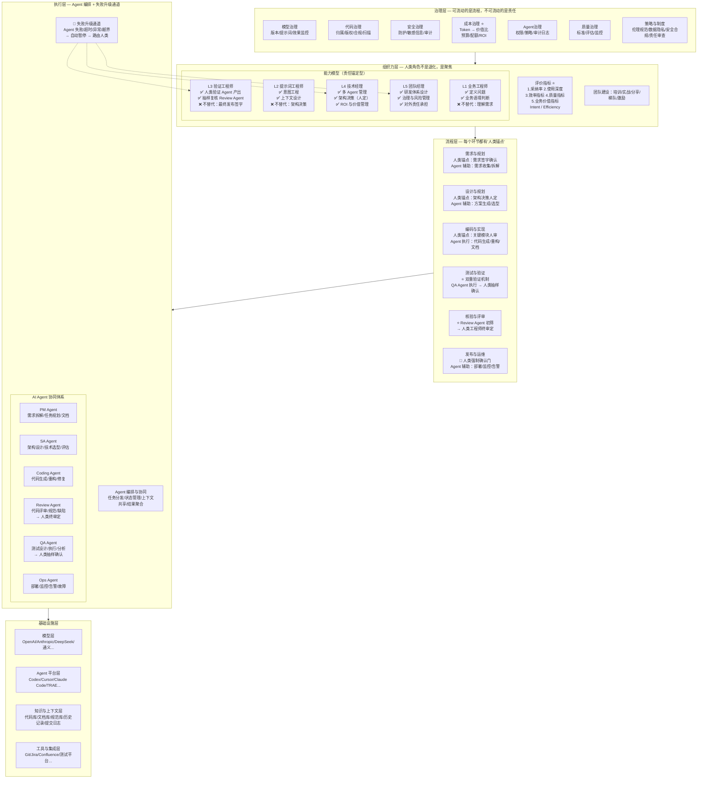

# AI Coding 体系全景图（FAO 修正版）

> 基于 FAO（Fluid Agentic Organization）框架修正：先定义"什么不能流动"，再设计"什么可以流动"。

---

## 修正核心：五条硬约束

| 约束 | 原图问题 | FAO 修正 |
|------|---------|---------|
| **责任不可流动** | Review/QA Agent 把关，但无人兜底 | 每个 Agent 产出需人类锚点签字 |
| **发布必须人定** | 流程顺畅到发布，无硬卡点 | 发布前设"人类强制确认门" |
| **伪完成不可奖励** | "一次成功率"可能鼓励假阳性 | 改为"人实验证通过率" |
| **成本必须锚定价值** | 只监控 Token 消耗 | 监控"单位 Token 业务价值产出" |
| **失败必须有出口** | Agent 编排闭环自治 | Agent 异常自动升级人类 |

---

## 全景图（Mermaid）



---

## 关键修正点详解

### 1. 人类锚点（HUMAN ANCHOR）

每个流程环节都明确标注了"人类锚点"：

| 环节 | 人类不可下放的责任 | Agent 可辅助的工作 |
|------|-------------------|-------------------|
| 需求 | 需求签字确认 | 收集、拆解、整理 |
| 架构 | 架构决策人定 | 方案生成、技术选型建议 |
| 编码 | 关键模块人审 | 代码生成、重构、文档 |
| 测试 | 抽样确认覆盖度 | 用例生成、执行、缺陷报告 |
| 评审 | 终审决定是否合并 | 初筛、规范检查、缺陷标记 |
| **发布** | **🚪 强制确认门：必须人类签字** | 部署脚本、监控配置 |

### 2. 双重验证机制

原图：Review Agent → 通过 → 下一步

FAO 修正：
```
Review Agent 初筛 → 人类工程师抽样终审定 → 才能合并
QA Agent 执行测试 → 人类确认覆盖度 → 才能进入发布
```

> **未验证不能冒充已确认。** Agent 的"通过"只是初筛信号，不是最终确认。

### 3. 失败升级通道（ESCALATION）

```
Agent 运行中：
  ├─ 正常完成 → 进入下一环节
  ├─ 超时/异常 → 🚨 自动暂停 → 路由给 L3/L4 人类
  ├─ 产出质量低于阈值 → 🚨 返回重做 → 人类介入分析根因
  └─ 越界请求（如访问敏感数据）→ 🚨 立即阻断 → 安全审计
```

### 4. 成本治理：从"记账"到"价值锚定"

原图：Token 消耗监控、调用成本分析、预算与配额管理

FAO 修正：

| 指标类型 | 原图 | FAO 修正 |
|---------|------|---------|
| 成本指标 | Token 消耗量 | **Token → 业务价值比** |
| 效率指标 | 一次成功率 | **人实验证通过率** |
| 质量指标 | 缺陷率 | **逃逸缺陷率（到生产环境的缺陷）** |
| 价值指标 | 人均交付量 | **人均有效价值产出** |

> 成本计量方式决定组织激励结构。如果奖励"一次成功率"，Agent 会优化"第一次不报错"，而不是"真正正确"。

### 5. 人类角色重定义

原图暗示：人类从 L1 工程师 → L2 提示词工程师 → L3 监督者 → L4 管理者 → L5 团队经理（单向退化）

FAO 修正：

```
L1 业务工程师：不是被淘汰，而是聚焦"定义问题"
L2 提示词工程师：不是写提示词，而是设计"意图工程"
L3 验证工程师：新增角色——专门验证 Agent 产出（不可替代）
L4 技术经理：不是管 Agent，而是做"人定的架构决策"
L5 团队经理：对外承担最终责任（不能下放）
```

> **能力可以下放，责任不能消失。** 人类不是退化成"监督者"，而是聚焦到"只有人类能做的事"。

---

## 与原图的最大区别

| 维度 | 原图 | FAO 修正版 |
|------|------|-----------|
| 设计假设 | Agent 可以替代人类执行 | **Agent 可以辅助人类执行，但责任锚定在人** |
| 流程特征 | 端到端自动化 | **自动化 + 人类强制卡点** |
| 失败处理 | 闭环自治 | **自治 + 失败升级人类** |
| 成本视角 | 控制消耗 | **锚定价值** |
| 评价体系 | 效率导向 | **责任 + 价值导向** |
| 治理位置 | 旁路监控 | **嵌入每个环节** |

---

## 使用建议

1. **如果你要展示这张图**：强调"红色节点"是人类不可下放的责任锚点
2. **如果你要落地这个体系**：先试点"发布强制确认门"和"Review 双重验证"两个最小改动
3. **如果你要持续优化**：监控"逃逸缺陷率"和"Token→价值比"两个核心指标

要我帮你把这个图导出为飞书文档格式，或者进一步细化某个环节吗？
